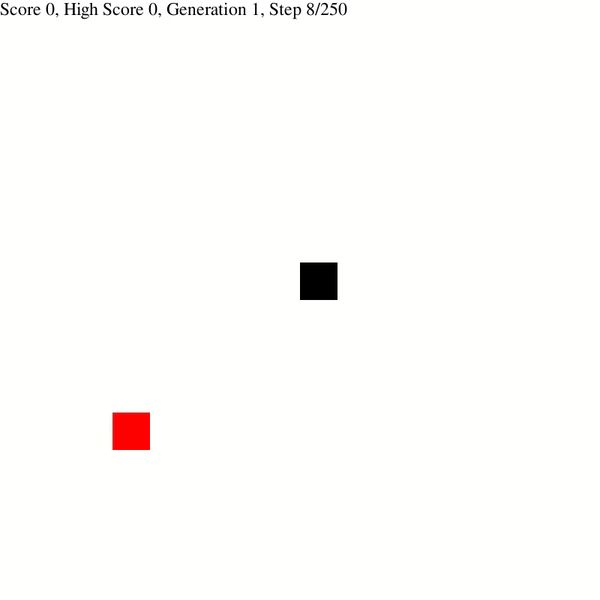
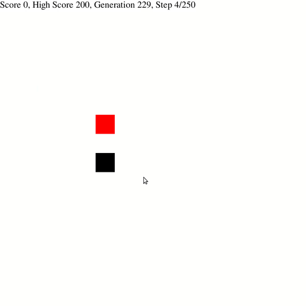

# snake_ai
A program to teach an AI to play Snake using Deep Reinforcement Learning.

<p>
  
  Before being trained for ~5 minutes. It doesn't know what it's doing, really.
  

</p>


<li>After being trained for ~5 minutes. Big difference!</li>



I used a DNQAgent from Tensorflow's <a href="https://www.tensorflow.org/agents"/>Agents</a> to train this AI in a custom environment that I built.


If you'd like to run this and see this visually, you may clone the repository and then run the command 
```
python3 snake.py
```


If you get any import or installation errors, the dependencies for this program are

<ul>
  <li> <a href="https://pypi.org/project/tensorflow/"/>Tensorflow</a></li>
  <li> <a href="https://pypi.org/project/tf-agents/"/>Tensorflow Agents</a></li>
  <li> <a href="https://pypi.org/project/pygame/"/>PyGame</a></li>
  <li> <a href="https://pypi.org/project/numpy/"/>NumPy</a></li>

</ul>


